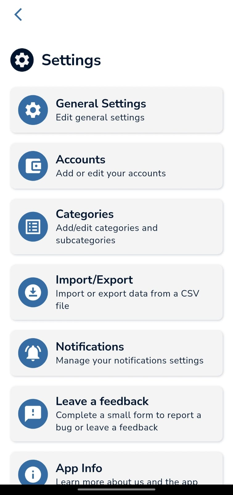
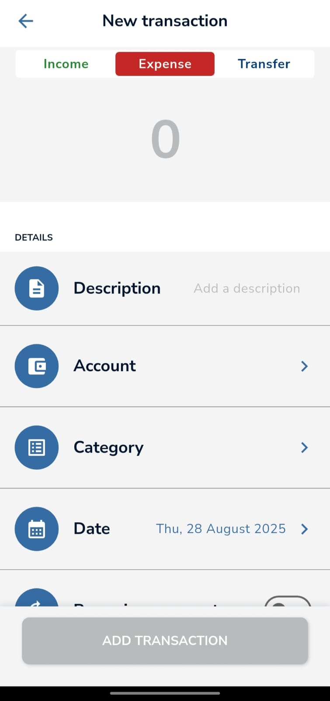
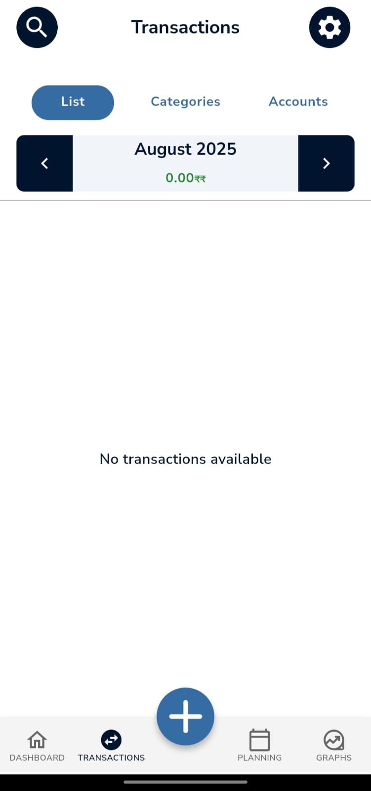
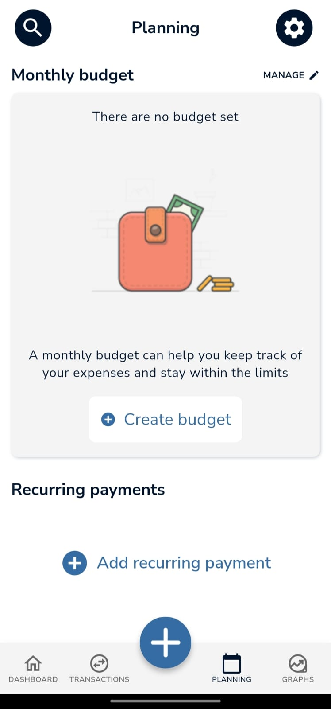
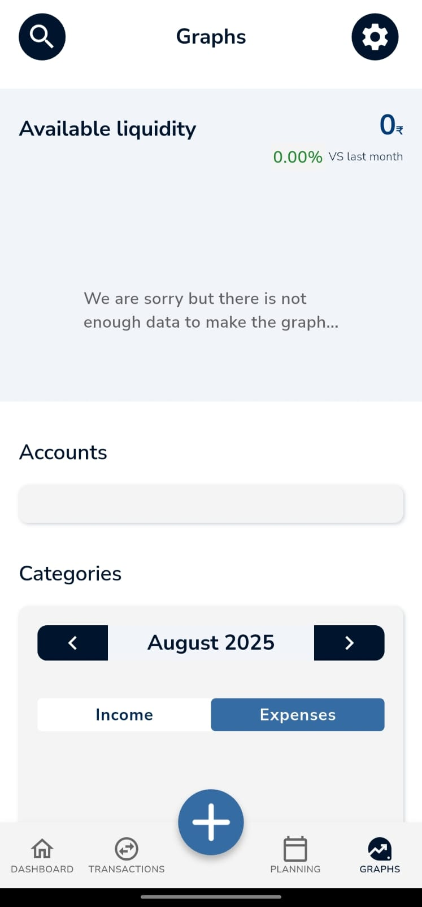
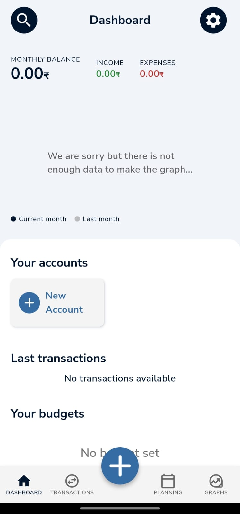

# 💰 FinanceTracker

A cross-platform *personal finance tracking app* built with *Flutter, enabling seamless experience on **Android, iOS, Web, and Desktop*.  
Easily track transactions, visualize spending, and manage budgets — all from a single project codebase.

---

## ✨ Features

- 🌍 *Multi-platform support*: Android, iOS, Web, Windows, macOS, Linux  
- 💸 *Expense & income tracking*: Add, edit, delete financial entries with categories and notes  
- 📊 *Dashboard & analytics*: Visual charts and summaries of spending, income, and trends  
- 🏷 *Category-wise insights*: Understand how much you're spending per category  
- ☁ *Cloud sync (optional)*: Integrate with Firebase or other services for cross-device sync  

---

## 🛠 Tech Stack

| Layer       | Technology                                     |
|-------------|------------------------------------------------|
| *UI*      | Flutter                                        |
| *State Mgmt* | Provider / Bloc / Riverpod / GetX (choose)  |
| *Backend* | SQLite / Firebase / REST API (choose)          |
| *Charts*  | charts_flutter / syncfusion_flutter_charts     |
| *CI / Testing* | GitHub Actions / flutter_test             |

---

## 🚀 Getting Started

### ✅ Prerequisites
- Flutter installed (*version >= 3.0*)  
- An IDE like *VS Code* or *Android Studio*

### ⚡ Installation

bash
git clone https://github.com/Navgarg30/FinanceTracker.git
cd FinanceTracker
flutter pub get
flutter run

To target specific platforms:

bash
Copy code
flutter run -d chrome    # Web
flutter run -d windows   # Windows
flutter run -d android   # Android
# etc.

---

## 📱 Usage

Launch the app on your preferred device/emulator

Navigate to the Transactions tab to add or view entries

Use the Dashboard to spot category-wise spending trends

(Optional) Enable cloud sync by integrating Firebase in lib/services/

Feel free to experiment with the UI, add charts, or enhance tracking logic!

---

## 📂 Project Structure

css
/
├── android/       – Android platform code
├── ios/           – iOS platform code
├── web/           – Web build code
├── linux/, macos/, windows/ – Desktop builds
├── lib/
│   ├── models/        – Data models (e.g. Transaction)
│   ├── screens/       – UI screens (Dashboard, Add Transaction)
│   ├── services/      – DB, cloud syncing, analytics logic
│   └── main.dart      – App entrypoint
├── test/          – Unit and widget tests
├── pubspec.yaml   – Dependency config
└── README.md      – This file

---

## 🧪 Testing
Run unit and widget tests with:

bash
flutter test
Add your own tests under the test/ directory to maintain code quality and confidence.

---

## 🤝 Contributing

Contributions are welcome! 🚀

Fork the repo

1. Create a feature branch → feature/my-feature
2. Commit changes → git commit -m "Add my feature"
3. Push branch → git push origin feature/my-feature
4. Open a Pull Request with a clear description

👉 Please ensure code follows Flutter best practices and is well-tested.

## 📸 Screenshots  

  
  
  
   
  
  
  
  

